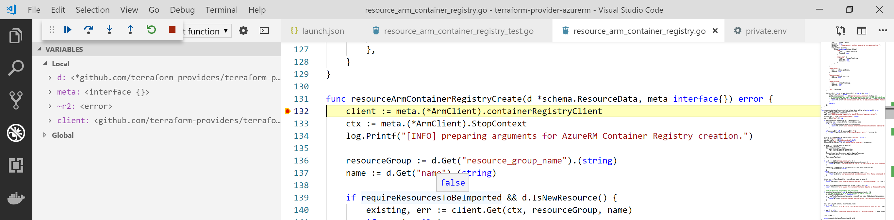

# Contribute to Terraform AzureRM provider

This document describe how you can get ready to contribute to the [AzureRM Terraform provider](https://github.com/terraform-providers/terraform-provider-azurerm).

## Setup your system

### Terraform

You need to install Terraform on your dev environment. You can downlaod it from [this page](https://www.terraform.io/downloads.html).

### Go tools

Terraform is developed using Go. You need to install Go **1.11.x** to be able to build and debug the provider locally.
You can download it from [this page](https://golang.org/dl/) and find the installation instructions for your system [here](https://golang.org/doc/install#install)

Then you can test your environment following the instructions on [this page](https://golang.org/doc/install#testing).

### Check you GOPATH

As of many Go project, AzureRM Terraform provider rely on your GOPATH environment variable. You may want to make sure it is well configured for your system, reading [this page](https://github.com/golang/go/wiki/SettingGOPATH).

### Visual Studio Code

You can use the IDE you love, but in this documentation we will describe how to contribute to the Terraform AzureRM provider using Visual Studio Code. You can download it for your system from [this page](https://code.visualstudio.com/Download).

Once installed, download the Go extension for VS Code:


Once installed, open VS Code and look for the `Go: Install/Update Tools` in the command palette, a select all the tools:


### Specific requirements for Windows users

If you are running Windows, then you need to install Git Bash and Make for Windows. Check the dedicated section on Terraform on Azure repository [here](https://github.com/terraform-providers/terraform-provider-azurerm#windows-specific-requirements).

## Get the sources

First, go to the [AzureRM Terraform provider](https://github.com/terraform-providers/terraform-provider-azurerm) project page and fork the repository into your GitHub account.

Once done, you need to clone your fork into the `$GOPATH/src/github.com/terraform-providers/terraform-provider-azurerm` folder.

## Build the sources

You can check that everything is OK by building the AzureRM provider:

```bash
cd $GOPATH/src/github.com/terraform-providers/terraform-provider-azurerm
make build
```

Once completed, the binary of the AzureRM provider should be available in the `$GOPATH/bin` directory.

*Note: on Windows, you need to use Git Bash*

More information [here](https://github.com/terraform-providers/terraform-provider-azurerm#developing-the-provider).

## Work with your local build

Once you have built a new version of the AzureRM Terraform provider, you can use it locally.
To use your local version, the first thing to do is a `terraform init`, as usual, to inialize your terraform working directory.

The init operation will download the AzureRM Provider for you. You can just remove it, and replace it with your local copy.

Do a `terraform init` again and you're done ! :-) 

## Debug the AzureRM provider using Visual Studio Code and Delve

It is possible to use Visual Studio Code and Delve (the Golang debugger) to debug the AzureRM provider.
The easiest way to debug Terraform AzureRM Provider is to execute the acceptances unit test with the Delve debugger attached. Acceptance tests are tests that are written for every resources and data sources and that will really execute the code to an Azure subscription, to validate everything is working well.

First, to be able to connect to Azure, you need to create a service principal using the following command:

```bash
az ad sp create-for-rbac --role=Contributor --scope=/subscriptions/<YOUR_SUBSCRIPTION_ID>
```

Then, you need to create a `.launch.json` file inside the `.vscode` folder at the root of the Terraform AzureRM provider directory (create the `.vscode` folder if it does not exist).

Copy the following content into the file:

```json
{
    // Use IntelliSense to learn about possible attributes.
    // Hover to view descriptions of existing attributes.
    // For more information, visit: https://go.microsoft.com/fwlink/?linkid=830387
    "version": "0.2.0",
    "configurations": [
        {
            "name": "Launch test function",
            "type": "go",
            "request": "launch",
            "mode": "test",
            "program": "${workspaceRoot}/azurerm/resource_arm_container_registry_test.go",
            "args": [
                "-test.v",
                "-test.run",
                "TestAccAzureRMContainerRegistry_geoReplication"
            ],
            "envFile": "${workspaceRoot}/.vscode/private.env",
            "showLog": true
        },
    ]
}
```

The configuration above allows to start debugging a Terraform resource, by launching one or more acceptance test:

- The `program` property indicates the file you want to debug
- The last entry of the `args` property, here `TestAccAzureRMContainerRegistry_geoReplication` represents th test to launch. You can use regex to run multiple tests (ex: `TestAccAzureRMContainerRegistry_*`)
- The `envFile` property defines the path to get the environment variables file (mainly Azure credentials) that needs to be used to run the acceptance test.

Create the `private.env` file into the `.vscode` folder and fill it with the following environment variables:

```
ARM_CLIENT_ID=<YOUR_SERVICE_PRINCIPAL_CLIENT_ID>
ARM_CLIENT_SECRET=<YOUR_SERVICE_PRINCIPAL_CLIENT_SECRET>
ARM_SUBSCRIPTION_ID=<YOUR_AZURE_SUBSCRIPTION_ID>
ARM_TENANT_ID=<YOUR_AZURE_TENANT_ID>
ARM_TEST_LOCATION=<AZURE_LOCATION_1>
ARM_TEST_LOCATION_ALT=<AZURE_LOCATION_2>
TF_ACC=1
```

Once done, you can just press F5 and the debug will start! You can place breakpoints in your code to do step by step debugging:



*Note: the first time your start the debug, it can take a while, you need to be patient :-)*

## Other

### Slack

You can request an invite to access the Terraform on Azure Slack [here](https://join.slack.com/t/terraform-azure/shared_invite/enQtNDMzNjQ5NzcxMDc3LTJkZTJhNTg3NTE5ZTdjZjFhMThmMTVmOTg5YWJkMDU1YTMzN2YyOWJmZGM3MGI4OTQ0ODQxNTEyNjdjMDAxMjM).