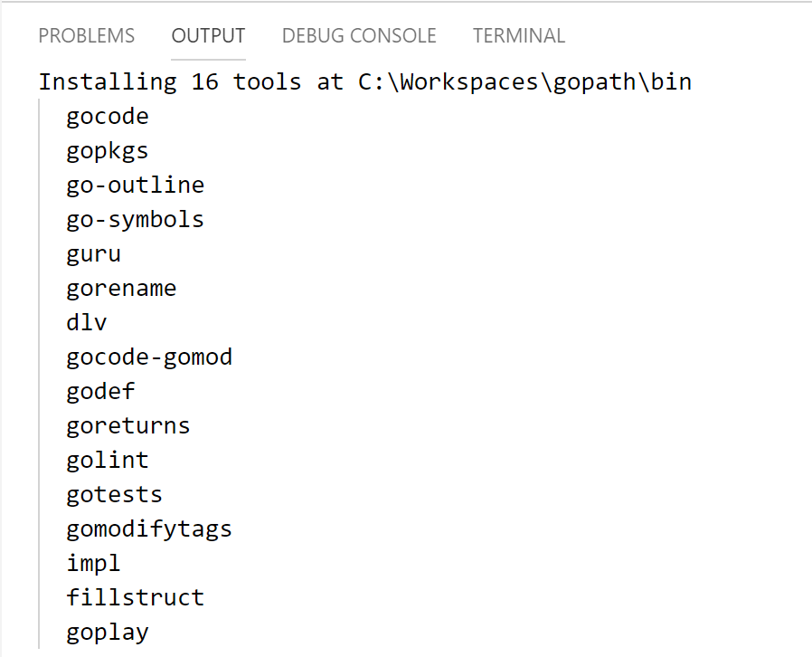

# Contribute to Terraform AzureRM provider

This document describe how you can get ready to contribute to the [AzureRM Terraform provider](https://github.com/terraform-providers/terraform-provider-azurerm).
We also recommend that you read the [README](https://github.com/terraform-providers/terraform-provider-azurerm/blob/master/README.md) on the AzureRM Terraform Provider repository.

## Setup your system

### Terraform

You need to install Terraform on your dev environment. You can downlaod it from [this page](https://www.terraform.io/downloads.html).

### Go tools

Terraform is developed using Go Programming Language. You need to install Go Programming Language **1.11.x** to be able to build and debug the provider locally.
You can download it from [this page](https://golang.org/dl/) and find the installation instructions for your system [here](https://golang.org/doc/install#install)

Then you can test your environment following the instructions on [this page](https://golang.org/doc/install#testing).

### Check your environment variables

As with many Go project, AzureRM Terraform provider rely on your GOPATH environment variable. You may want to make sure it is well configured for your system, reading [this page](https://github.com/golang/go/wiki/SettingGOPATH).

### Visual Studio Code

You can use the IDE you love, but in this documentation we will describe how to contribute to the Terraform AzureRM provider using Visual Studio Code. You can download it for your system from [this page](https://code.visualstudio.com/Download).

Once installed, download the Go extension for VS Code:


Once installed, open VS Code and look for the `Go: Install/Update Tools` in the command palette, a select all the tools:




### Specific requirements for Windows users

If you are running Windows, then you need to install Git Bash and Make for Windows. Check the dedicated section on Terraform on Azure repository [here](https://github.com/terraform-providers/terraform-provider-azurerm#windows-specific-requirements).

## Get the sources

First, go to the [AzureRM Terraform provider](https://github.com/terraform-providers/terraform-provider-azurerm) project page and fork the repository into your GitHub account.

Once done, you need to clone your fork into the `$GOPATH/src/github.com/terraform-providers/terraform-provider-azurerm` folder.

## Build the sources

You can check that everything is OK by building the AzureRM provider:

```bash
cd $GOPATH/src/github.com/terraform-providers/terraform-provider-azurerm
make build
```

Once completed, the binary of the AzureRM provider should be available in the `$GOPATH/bin` directory.

*Note: on Windows, you need to use Git Bash*

More information [here](https://github.com/terraform-providers/terraform-provider-azurerm#developing-the-provider).

## Work with your local build

Once you have built a new version of the AzureRM Terraform provider, you can use it locally.
To use your local version, the first thing to do is a `terraform init`, as usual, to inialize your terraform working directory.

If your `terraform` binary is in the `$GOPATH/bin` folder on your machine, then the terraform init operation will use the locally built provider. 

If not, the init operation will download the AzureRM Provider for you. You can just remove it, and replace it with your local copy. Do a `terraform init` again and you're done ! :-) 

`terraform init` will look for the providers in the folder where the `.tf` files are located, so it is possible to just copy the provider from `$GOPATH/bin` to your current folder and it will be used instead of getting downloaded. 


## Debug the AzureRM provider using Visual Studio Code and Delve

It is possible to use Visual Studio Code and Delve (the Golang debugger) to debug the AzureRM provider.
The easiest way to debug Terraform AzureRM Provider is to execute the acceptances unit test with the Delve debugger attached. Acceptance tests are tests that are written for every resources and data sources and that will really execute the code to an Azure subscription, to validate everything is working well.

First, to be able to connect to Azure, you need to create a service principal using the following command:

```bash
az ad sp create-for-rbac --role=Contributor --scope=/subscriptions/<YOUR_SUBSCRIPTION_ID>
```

Then, you need to create a `.launch.json` file inside the `.vscode` folder at the root of the Terraform AzureRM provider directory (create the `.vscode` folder if it does not exist).

Copy the following content into the file:

```json
{
    // Use IntelliSense to learn about possible attributes.
    // Hover to view descriptions of existing attributes.
    // For more information, visit: https://go.microsoft.com/fwlink/?linkid=830387
    "version": "0.2.0",
    "configurations": [
        {
            "name": "Launch test function",
            "type": "go",
            "request": "launch",
            "mode": "test",
            "program": "${workspaceRoot}/azurerm/resource_arm_container_registry_test.go",
            "args": [
                "-test.v",
                "-test.run",
                "TestAccAzureRMContainerRegistry_geoReplication"
            ],
            "envFile": "${workspaceRoot}/.vscode/private.env",
            "showLog": true
        },
    ]
}
```

The configuration above allows to start debugging a Terraform resource, by launching one or more acceptance test:

- The `program` property indicates the file you want to debug
- The last entry of the `args` property, here `TestAccAzureRMContainerRegistry_geoReplication` represents th test to launch. You can use regex to run multiple tests (ex: `TestAccAzureRMContainerRegistry_*`)
- The `envFile` property defines the path to get the environment variables file (mainly Azure credentials) that needs to be used to run the acceptance test.

Create the `private.env` file into the `.vscode` folder and fill it with the following environment variables:

```
ARM_CLIENT_ID=<YOUR_SERVICE_PRINCIPAL_CLIENT_ID>
ARM_CLIENT_SECRET=<YOUR_SERVICE_PRINCIPAL_CLIENT_SECRET>
ARM_SUBSCRIPTION_ID=<YOUR_AZURE_SUBSCRIPTION_ID>
ARM_TENANT_ID=<YOUR_AZURE_TENANT_ID>
ARM_TEST_LOCATION=<AZURE_LOCATION_1>
ARM_TEST_LOCATION_ALT=<AZURE_LOCATION_2>
TF_ACC=1
```

*Note: it is possible to customize the logging level of Terraform. It might be super useful in some situations. It can be done by setting the `TF_LOG` environment variable. Refer to [the official debugging documentation](https://www.terraform.io/docs/internals/debugging.html) for more details.*

Once done, you can just press F5 and the debug will start! You can place breakpoints in your code to do step by step debugging:


*Note: the first time your start the debug, it can take a while, you need to be patient :-)*

## How to contribute to the Azure RM provider

*Note: we also invite you to read the official documentation about developing a provider [here](https://www.terraform.io/docs/plugins/basics.html#developing-a-plugin)*

First you need to pick [an issue on the provider](https://github.com/terraform-providers/terraform-provider-azurerm/issues) by commenting the issue and saying that you're going to work on that, to make sure that the repo maintainers are aware that you are going to work on this issue.
We also strongly advise that you describe the work you are planning to do, like explaining your implementation, submitting the TF schema for new resources, to make sure the discussion start early as possible with the reviewers.

*Note: if there is no issue for the problem you are trying to solve, you can create one.*

If you are a new contributor, there is a [good first issue](https://github.com/terraform-providers/terraform-provider-azurerm/issues?q=is%3Aissue+is%3Aopen+label%3A%22good+first+issue%22) label that may help you to filter the issue and start with a simple one.

For each piece of code that you write into the provider, you need to make sure that you have:

- the implementations of the `data source` and/or `resource` definition
- acceptance test created or updated
- documentation created or updated
- example created or updated (optional)

Data sources, resources and tests are defined in the [azurerm](https://github.com/terraform-providers/terraform-provider-azurerm/tree/master/azurerm) folder of the repository.

Documentation for data sources is in the [website/docs/d](https://github.com/terraform-providers/terraform-provider-azurerm/tree/master/website/docs/d) folder and documentation for resources is in the [website/docs/r](https://github.com/terraform-providers/terraform-provider-azurerm/tree/master/website/docs/r) folder.

Finally, examples are located in the [examples](https://github.com/terraform-providers/terraform-provider-azurerm/tree/master/examples) folder.

AzureRM Terraform provider uses the [Azure SDK for Go](https://github.com/Azure/azure-sdk-for-go) to interact with Azure. It's important that you respect that rule. If you are trying to do something that is not available in the Azure SDK for Go, then you should open an issue on that repository first.

We recommand that you start with fixing issues/patching an existing data source or resource to understand how it works in details before trying to implement a brand new one.

Don't forget that you are working on your own fork of the repository and that you need to open a pull request to the main repository to bring your update to the HashiCorp team, for review.

### Working with Azure SDK for Go

All the imports for the Azure Go SDK services have to be done in the [config.go](https://github.com/terraform-providers/terraform-provider-azurerm/blob/master/azurerm/config.go) file. It exposes a top level struct, `ArmClient` that exposes all the client that you may use in a data source or resource to interact with Azure.

For example, if you need to work on implementing Azure Batch Account support to the provider:

1. Add import for `"github.com/Azure/azure-sdk-for-go/services/batch/mgmt/2018-12-01/batch"` in the imports list
2. Add a field for the `batchAccountClient`:

```go
batchAccountClient     batch.AccountClient
```

3. Add a function that registers the Azure Batch client:

```go
func (c *ArmClient) registerBatchClients(endpoint, subscriptionId string, auth autorest.Authorizer) {
	batchAccount := batch.NewAccountClientWithBaseURI(endpoint, subscriptionId)
	c.configureClient(&batchAccount.Client, auth)
	c.batchAccountClient = batchAccount
}
```

4. Call the function that registers the Batch client:

```go
client.registerBatchClients(endpoint, c.SubscriptionID, auth)
```

By doing the four steps above, you will make sure that when developping the data source or the resource, you can access the Azure SDK for Go clients that you need.

### Developing a Data Source

The file for a data source is named following the convention: data_source_*NAME_OF_THE_DATA_SOURCE*.go.

A data source is composed of two relevant functions:

- The function that creates a `schema.Resource` object that returns the schema (definition) of the data source,i.e. the property that compose the data source, and some rules about those properties. You only need to provide required properties to locate that resource, and mark all other properties returned from the service as `Computed`.  This function is named by convention dataSourceArm*NAME_OF_THE_DATA_SOURCE*, for example `dataSourceArmBatchAccount` for a Batch Account.  
- The function that retrieves the data from Azure using the Azure SDK for Go client and set all the values related to the data source. This function is named by convention dataSourceArm*NAME_OF_THE_DATA_SOURCE*Read, for example `dataSourceArmBatchAccountRead` for a Batch Account.
 
This function takes a `schema.ResourceData` in parameter. You can get the name of the object to retrieve and any property that is defined by the user on that object:

```go
resourceGroup := d.Get("resource_group_name").(string)
name := d.Get("name").(string)
```

You can get a reference on any Azure SDK for Go client registered in the `client.go` using:

```go
client := meta.(*ArmClient).batchAccountClient
```

Finally, you can set values retrieve from Azure on the same object, using the `Set` function:

```go
d.Set("account_endpoint", resp.AccountEndpoint)
```

You can check the whole definition of the Azure Batch Account data source [here](https://github.com/terraform-providers/terraform-provider-azurerm/blob/master/azurerm/data_source_batch_account.go).

Once your data source is defined, you need to register it into data sources map in the `provider.go` file:

```go
DataSourcesMap: map[string]*schema.Resource{
            "azurerm_api_management":                         dataSourceApiManagementService(),
```

### Developing a resource

Developing a resource is really similar to developing a data source. Instead of having only a function to read the data from Azure, it also offers the possibility to write functions to create, update and delete the resource. Apart from that, concepts are the same:

- The file is named using the convention: resource_arm_*NAME_OF_RESOURCE*.go
- One function to define the schema of the resource, named by convention resourceArm*NAME_OF_RESOURCE*, for example `resourceArmBatchAccount`.
- One function to create the resource, named by convention resourceArm*NAME_OF_RESOURCE*Create, for example `resourceArmBatchAccountCreate`.
- One function to read the resource, named by convention resourceArm*NAME_OF_RESOURCE*Read, for example `resourceArmBatchAccountRead`.
- One function to update the resource, named by convention resourceArm*NAME_OF_RESOURCE*Update, for example `resourceArmBatchAccountUpdate`.
- One function to delete the resource, named by convention resourceArm*NAME_OF_RESOURCE*Delete, for example `resourceArmBatchAccountDelete`.

The [Azure Batch Account resource](https://github.com/terraform-providers/terraform-provider-azurerm/blob/master/azurerm/resource_arm_batch_account.go) is a good and simple example to understand the flow.

### Acceptance tests

Acceptance tests are test that will run live on your Azure subscription to validate that your data source or resource is working well. Each data source should have its acceptance tests and each resource should have its acceptance test.

Tests are definied in the `azurerm` directory, aside with data sources and resources. The file name is the same than the one for the data source or resource, with the `_test` suffix.

You can find examples of tests for Azure Batch Account data source [here](https://github.com/terraform-providers/terraform-provider-azurerm/blob/master/azurerm/data_source_batch_account_test.go) and Azure Batch Account resource [here](https://github.com/terraform-providers/terraform-provider-azurerm/blob/master/azurerm/resource_arm_batch_account_test.go).

Please refer to the above section to learn on to run the acceptance tests on your laptop.

Once your resource is defined, you need to register it into the resources map in the `provider.go` file:

```go
ResourcesMap: map[string]*schema.Resource{
			"azurerm_api_management":                                     resourceArmApiManagementService(),
``` 

## Other

### Slack

You can request an invite to access the Terraform on Azure Slack [here](https://join.slack.com/t/terraform-azure/shared_invite/enQtNDMzNjQ5NzcxMDc3LTJkZTJhNTg3NTE5ZTdjZjFhMThmMTVmOTg5YWJkMDU1YTMzN2YyOWJmZGM3MGI4OTQ0ODQxNTEyNjdjMDAxMjM).

### Configuring Terraform on Windows 10 Linux Sub-System

It is also possible to configure Terraform to be run from the Windows 10 Linux Sub-System (WSL). Check [this blog post](https://techcommunity.microsoft.com/t5/Azure-Developer-Community-Blog/Configuring-Terraform-on-Windows-10-Linux-Sub-System/ba-p/393845) for more information.

