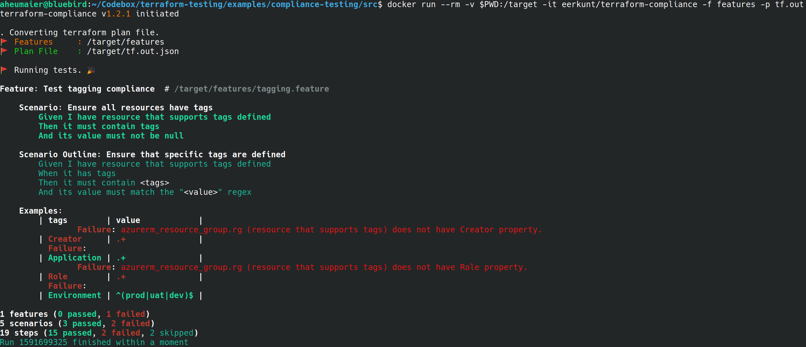
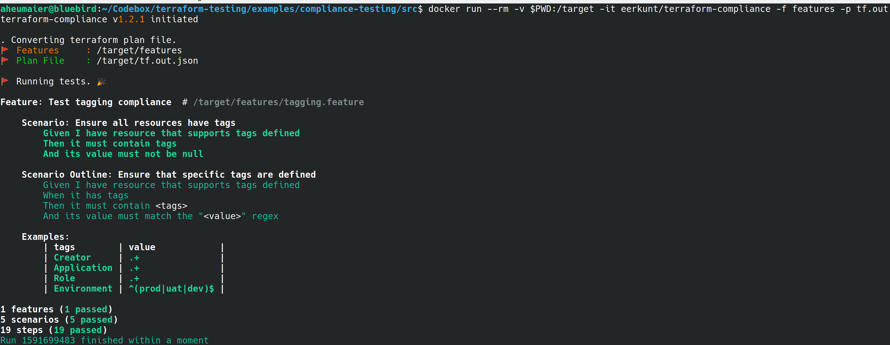

# Tutorial: Terraform Compliance Testing

Compliance testing, also known as Conformance testing, is a nonfunctional testing technique which is done to validate whether the system developed meets the organization’s prescribed standards or not. Most software teams do an analysis to check that the standards are properly enforced and implemented. Often working simultaneously to improve the standards, which will, in turn, lead to better quality.

> Note: this sample is used as the support for the [Terraform on Azure - Compliance testing](https://docs.microsoft.com/azure/developer/terraform/best-practices-compliance-testing) documentation.

## When to use Compliance Testing

Compliance testing is performed to ensure the compliance of the deliverables of each phase of the development lifecycle. If you you have to enforce sufficient tests to validate the degree of compliance to the methodology and identify the violators. 
It is important that the compliance check should be made right from the inception of the project than at the later stage because it would be difficult to correct the application when the requirement itself is not adequately documented.

## How to do a compliance check

Doing Compliance checks is quite straight forward. A set of standards and procedures are developed and documented for each phase of the development lifecycle. Deliverables of each phase need to compare against the standards and find out the gaps. Compliance testing is basically done through the inspection process and the outcome of the review process should be well documented.

Let's apply that to a [Terraform](https://terraform.io) driven infrastructure by giving a more specific example: 

One of the problems you might have in your team is environments getting hosed when different people apply changes. One person works on a change and applies resources e.g. a VM to a test environment. Then someone else applies a different version of the code from their own machine, provision another version of that VM. Things get confusing and messy. 

An obvious response could be to call out a policy to require tags on resources where applicable and add a `role` and `creator` tag to the resource that is deployed. [Terraform-compliance](https://terraform-compliance.com) is a tool that helps you with that. It mainly focuses on negative testing instead of having fully-fledged functional tests that are mostly used for proving a component of code is performing properly.

Fortunately, `terraform` is a marvellous abstraction layer for any API that creates/updates/destroys entities. `Terraform` also provides the capability to ensure everything is up-to-date between the local configuration and the remote API(s) responses. Since `terraform` is mostly used against Cloud APIs we still miss a way to ensure the code deployed against the infrastructure must follow specific policies - like HashiCorp currently provides with [Sentinel](https://docs.hashicorp.com/sentinel/intro/what/) for Enterprise Products. `Terraform-compliance` is providing a similar functionality only for terraform while it is free-to-use and it is Open Source.

A sample compliance policy for the issue mentioned could be like this: `if you are working with Azure, you should not create a resource, without having any tags`.`Terraform-compliance` provides a test framework to create these policies that will be executed against your terraform plan file in a context where both developers and security teams can understand easily while reading it, by applying [Behaviour Driven Development](https://en.wikipedia.org/wiki/Behavior-driven_development) principles.

## Get the Idea 

Going back to the example, the above will be translated into a BDD Feature and Scenario, as also seen in below:

```Cucumber
if you are working with Azure, you should not create a resource, without having any tags
```

translates into:

```Cucumber
Given I have resources that supports tags defined
Then it must contain tags
And its value must not be null
```

Further specific configurations are coming from the terraform code, as shown below ;

```hcl
resource "random_uuid" "uuid" {}

resource "azurerm_resource_group" "rg" {
  name     = "rg-hello-tf-${random_uuid.uuid.result}"
  location = var.location

  tags = {
    environment = "dev"
    application = "Azure Compliance"
  } 
}
```


The first policy could be written as a [BDD Feature Scenario](https://gherkin.io/docs/gherkin/reference/) like this: 

```Cucumber
Feature: Test tagging compliance  # /target/src/features/tagging.feature
    Scenario: Ensure all resources have tags
        Given I have resource that supports tags defined
        Then it must contain tags
        And its value must not be null
```

Following a second scenario test for a specific tag

```Cucumber
Scenario Outline: Ensure that specific tags are defined
    Given I have resource that supports tags defined
    When it has tags
    Then it must contain <tags>
    And its value must match the "<value>" regex

    Examples:
      | tags        | value              |
      | Creator     | .+                 |
      | Application | .+                 |
      | Role        | .+                 |
      | Environment | ^(prod\|uat\|dev)$ |
```

## How-to run this example

The example above is taken from the [github.com/Azure/terraform](https://github.com/Azure/terraform/tree/compliance-testing/examples/master) repository.

After checkout the repo ...

```bash 
cd ./terraform-testing/examples/compliance-testing/src
```
... we create a terraform planfile in `./src/ we going to test against.

```bash
cd src/ 
terraform init 
terraform validate 
terraform plan -out tf.out 
terraform apply -target=random_uuid.uuid
docker pull eerkunt/terraform-compliance
```

Now we are ready to run the tests suite.

```bash 
docker run --rm -v $PWD:/target -it eerkunt/terraform-compliance -f features -p tf.out
```

### From Red to Green

This should result in a failing test run. We see our first rule of requiring existence of tags suceed but we don't comply with the full spec of tags: `Role` and `Creator` tags are missing:



Make the test green again by adding all required tags to `main.tf`:

```hcl 
  tags = {
    Environment = "dev"
    Application = "Azure Compliance"
    Creator     = "Azure Compliance"
    Role        = "Azure Compliance"
  } 

```

Let's update the plan file again to reflect the updated state:

```bash 
terraform validate 
terraform plan -out tf.out 
```

Now, we should be green when running the tests suite again. We see our first rule of requiring existence of tags suceed and now we also provide the full spec of tags too:



