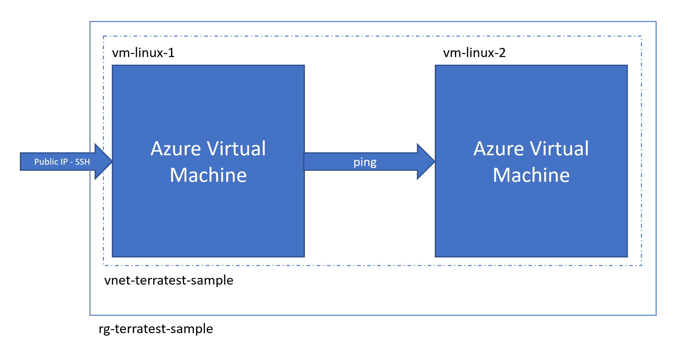

# Terraform end-to-end testing

This is an example of how to use [Terratest](https://github.com/gruntwork-io/terratest) to perform end-to-end testing on a Terraform project.

> Note: this sample is used as the support for the [Terraform on Azure - End-to-end testing](https://docs.microsoft.com/azure/developer/terraform/best-practices-end-to-end-testing) documentation.

## What about end-to-end testing

End-to-end tests validate that a program actually works in real conditions, the closest as possible to production environment. Let's imagine that we are writing a Terraform module to deploy two virtual machines into a virtual network but we don't want those machines to be able to ping each other. End-to-end tests are exactly what we need to make sure that the deployment of this module create the expected resources, but also that the virtual machines cannot ping each other.

In order to achieve that, the end-to-end test will apply the Terraform configuration, run all required tests, and finally tear down the infrastructure. They are much longer than integration or unit tests so they are not executed part of the continuous integration process.

## What about Terratest

[Terratest](https://github.com/gruntwork-io/terratest) is an open-source framework, written in [Go](http://golang.org/dl) and relying on the Go test framework, that helps to write end-to-end tests for Terraform projects. It provides helper and tools to:

1. Deploy a Terraform configuration
2. Goes back to the Go tests to validate what has been actually deployed
3. Tear down the deployed infrastructure

## Scenario of this sample

In this sample, we are going to use a Terraform configuration that deploys two Linux virtual machines into the same virtual network. `vm-linux-1` has a public IP address. Only port 22 is opened to allow SSH connection. `vm-linux-2` has no public IP address. The scenario we want to validate with the end-to-end test is to make sure that:

- infrastructure is deployed correctly
- it's possible to open an SSH session to `vm-linux-1` using port 22
- it's possible to ping `vm-linux-2` from `vm-linux-1` SSH session



> NOTE: this is a simple scenario to illustrate how to write a basic end-to-end test. We don't recommend having production virtual machines that exposes SSH port over a public IP address.

## Terraform configuration

The Terraform configuration for this scenario can be found in the [src/main.tf](src/main.tf) file. It contains everything to deploy the Azure infrastructure represented on the figure above.

If you are not familiar with creating a Linux virtual machine using Terraform we recommend that you read [this page of the documentation](https://docs.microsoft.com/azure/developer/terraform/create-linux-virtual-machine-with-infrastructure) before.

## End-to-end test

As mentioned in the introduction, the end-to-end test is written in Go language and uses the Terratest framework. It is defined in the [src/test/end2end_test.go](src/test/end2end_test.go) file.

This is the common structure of a Golang test using Terratest:

```Go
package test

import (
    "testing"

    "github.com/gruntwork-io/terratest/modules/terraform"
    test_structure "github.com/gruntwork-io/terratest/modules/test-structure"
)

func TestEndToEndDeploymentScenario(t *testing.T) {
    t.Parallel()

    fixtureFolder := "../"

    // Use Terratest to deploy the infrastructure
    test_structure.RunTestStage(t, "setup", func() {
        terraformOptions := &terraform.Options{
            // Indicate the directory that contains the Terraform configuration to deploy
            TerraformDir: fixtureFolder,
        }

        // Save options for later test stages
        test_structure.SaveTerraformOptions(t, fixtureFolder, terraformOptions)

        // Triggers the terraform init and terraform apply command
        terraform.InitAndApply(t, terraformOptions)
    })

    test_structure.RunTestStage(t, "validate", func() {
        // run validation checks here
        terraformOptions := test_structure.LoadTerraformOptions(t, fixtureFolder)
		publicIpAddress := terraform.Output(t, terraformOptions, "public_ip_address")
    })

    // When the test is completed, teardown the infrastructure by calling terraform destroy
    test_structure.RunTestStage(t, "teardown", func() {
        terraformOptions := test_structure.LoadTerraformOptions(t, fixtureFolder)
        terraform.Destroy(t, terraformOptions)
    })
}
```

As you can see in the snippet above, the test is composed by three stages:

1. `setup`: this stage is responsible for running Terraform to deploy the configuration.
2. `validate`: this stage is responsible for doing the validation checks / assertions.
3. `teardown`: this stage is responsible for cleaning up the infrastructure.

Some relevant functions provided by Terratest framework are:

- `terraform.InitAndApply` allows to run the `terraform init` and `terraform apply` commands from Go code.
- `terraform.Output` allows to retrieve the value of a deployment output variable.
- `terraform.Destroy` allows to run the `terraform destroy` command from Go code.
- `test_structure.LoadTerraformOptions` allows to load Terraform options (config, variables etc.) from the state.
- `test_structure.SaveTerraformOptions` allows to save Terraform options (config, variables etc.) to the state.

## Run the end-to-end test

Running the test requires that Terraform is installed and configured on your machine and that you are connected to your Azure subscription with the Azure CLI command `az login`.

Once ready, since the end-to-end test is just a Go test, it can be run like the following:

```console
# Set the path of the SSH private key to use to connect the virtual machine
export TEST_SSH_KEY_PATH="/home/bob/.ssh/id_rsa"
cd test
go test -v ./ -timeout 30m
```

Once the test is ended, it displays the results:

```console
--- PASS: TestEndToEndDeploymentScenario (390.99s)
PASS
ok      test    391.052s
```
