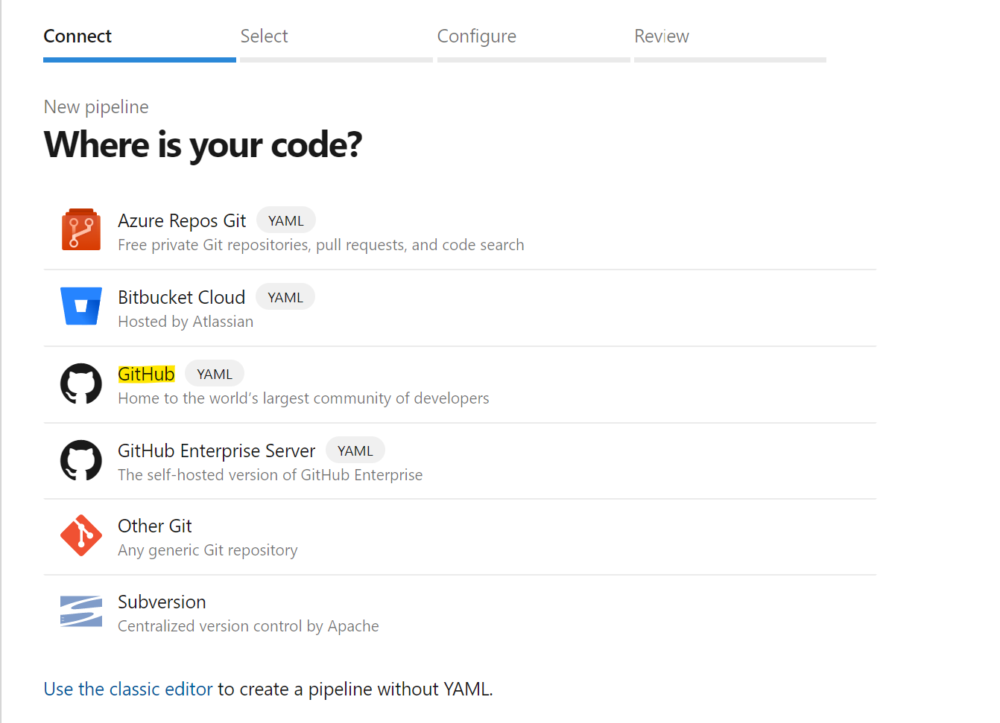
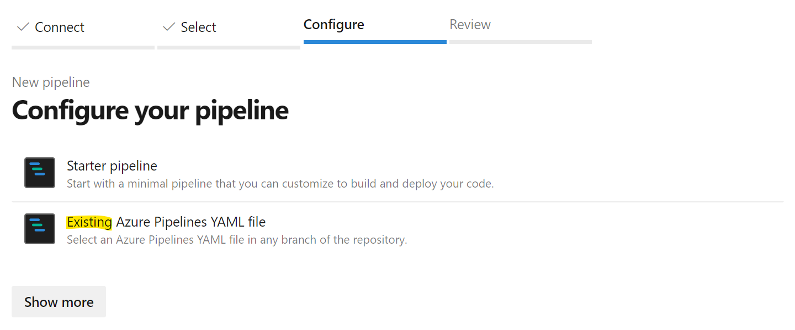
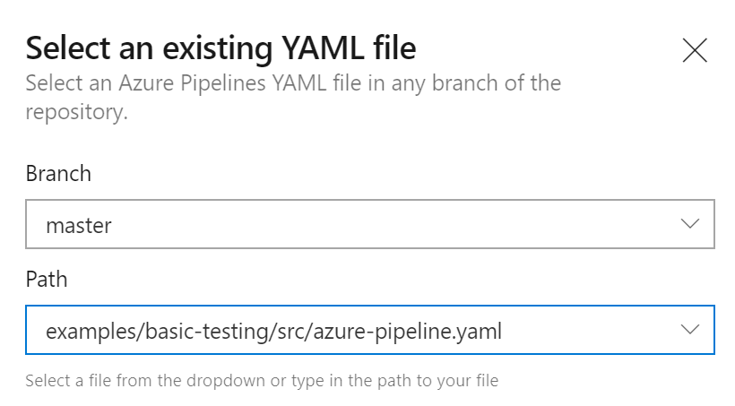
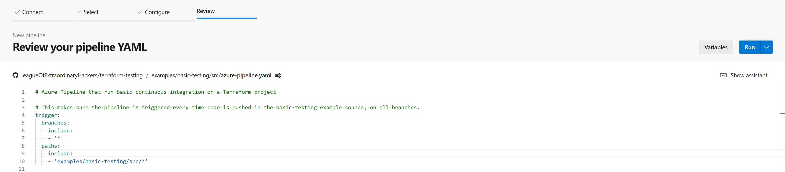
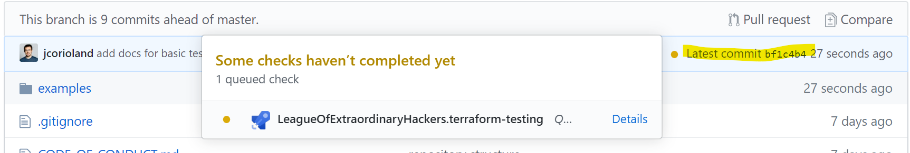
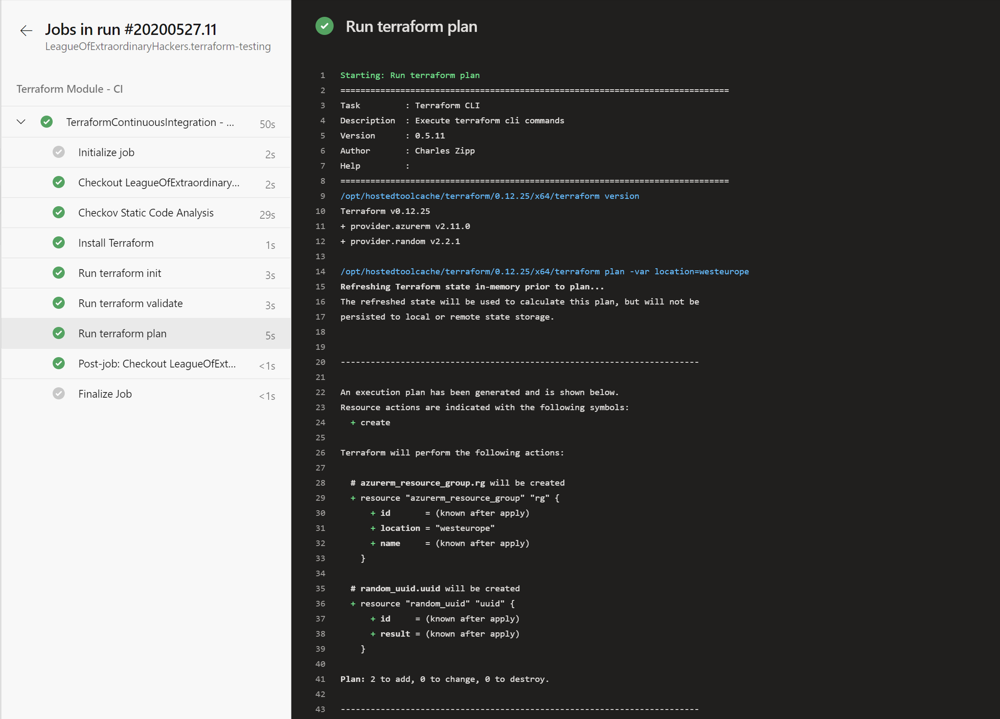

# Terraform Integration Testing

This is an example about the minimum level of integration testing that we recommend to be implemented on every Terraform project.

> Note: this sample is used as the support for the [Terraform on Azure - Integration testing](https://docs.microsoft.com/azure/developer/terraform/best-practices-integration-testing) documentation.

## What about integration testing

Testing is an important part of a software development project, and this is also for infrastructure as code projects. When working with Terraform, there are a bunch of tools that can help you to set up continuous integration quickly. Making sure that every time you and your colleagues are pushing changes, this code is automatically validated and tested.

This example shows how you can use Azure Pipeline to quickly set up a CI pipeline on a Terraform module. This pipeline is responsible for:

- Running static code analysis using [checkov](https://github.com/bridgecrewio/checkov)
- Running Terraform init
- Running Terraform validate
- Running Terraform plan

By running these steps, you will ensure that on every commit, the code that is pushed integrates with the existing code base and is valid from a syntax perspective as it can be executed by Terraform.

## Getting deep dive into this example

This example basically creates a resource group with a random name (see [main.tf](src/main.tf)):

```hcl
resource "random_uuid" "uuid" {}

resource "azurerm_resource_group" "rg" {
  name     = "rg-hello-tf-${random_uuid.uuid.result}"
  location = var.location
}
```

It also defines a [bash script](src/checkov.sh) responsible for running the static code analysis using Checkov tool.

Finally, it defines an [Azure YAML pipeline](src/azure-pipeline.yaml) responsible for executing the 4 steps described in the [above section](#what-about-basic-testing).

## How-to run this example

### Prerequisites

To run this example, you need to:

- Create a new Azure DevOps project. If you are not familiar with Azure DevOps, you can create an organization and your first project for free following [this documentation](https://docs.microsoft.com/en-us/azure/devops/organizations/projects/create-project?view=azure-devops&tabs=preview-page).
- Install the [Terraform Build & Release Tasks extension](https://marketplace.visualstudio.com/items?itemName=charleszipp.azure-pipelines-tasks-terraform) into your Azure DevOps organization
- Create an [Azure Service Connection](https://docs.microsoft.com/en-us/azure/devops/pipelines/library/connect-to-azure?view=azure-devops) named `terraform-basic-testing-azure-connection` allowing Azure Pipelines to connect to your Azure subscriptions (required to execute the terraform plan step)
- Fork this repository into your own GitHub organization

### Import the pipeline into Azure DevOps

Open your Azure DevOps project and go into the Azure Pipelines section. Click on the `Create Pipeline` button. On the `Where is your code?` select GitHub (YAML):



> Note: At this step, you might have to authorize Azure DevOps to access your organization, if you've not done that already. If you are not familiar with building GitHub repositories using Azure Pipelines you can have a look to [this documenation page](https://docs.microsoft.com/en-us/azure/devops/pipelines/repos/github?view=azure-devops&tabs=yaml).

In the repositories list, select the fork of this repository that you have created previously in your GitHub organization. In the `Configure your pipeline` step, choose to start from an existing YAML pipeline:



In the popup that opens, fill with the branch `master` and the path to the YAML pipeline `examples/basic-testing/src/azure-pipeline.yaml`:



Click on the `Continue` button. This will load the Azure YAML pipeline from GitHub. On the next page, you can click the `Run` button to create and manually trigger the pipeline for the first time:



### Run the pipeline

You can run the pipeline manually from the Azure DevOps UI or just commit new code to `example/basic-testing/src` folder of the repository. It will automatically trigger a new pipeline on the branch you are pushing the code:



And of course, you can access the details to ensure that everything ends up green in Azure DevOps:


